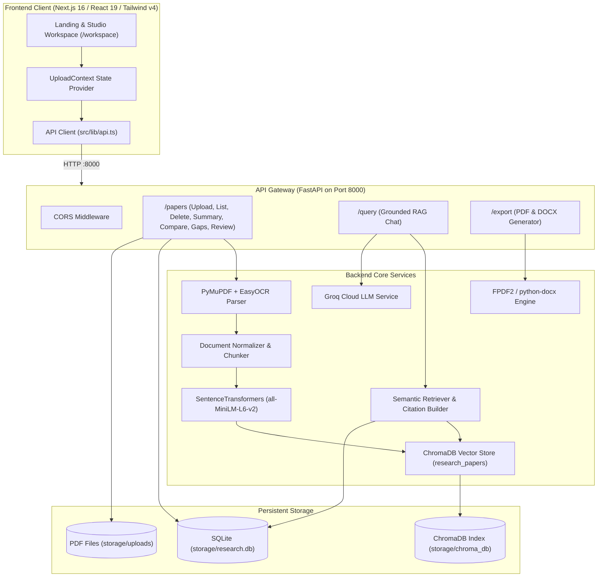

# Hackathon Baseline & System Audit Report: ResearchGPT Studio

> **Audit Date**: August 2026  
> **Auditor**: Senior Systems & AI Architect  
> **Phase**: Phase 0 — Protect and Audit Existing Baseline  
> **Document**: `HACKATHON_BASELINE.md`  

---

## 1. Executive Baseline Assessment

| System Component | Tested Subsystem | Status | Technical Finding |
| :--- | :--- | :---: | :--- |
| **Backend Runtime** | Python 3.10 + FastAPI + Uvicorn | `PASS` | Fast startup on port 8000, `/health` returns 200 OK. |
| **Relational Database** | SQLite (`storage/research.db`) | `PASS` | 16 papers currently recorded with full metadata. |
| **Vector Store** | ChromaDB (`storage/chroma_db`) | `PASS` | 971 dense chunks indexed with 384d HNSW cosine index. |
| **PDF Ingestion & OCR** | PyMuPDF + EasyOCR | `PASS` | Pipeline runs, parses pages, falls back to OCR if `< 30` chars. |
| **Document Processing** | Normalizer & 1000/200 Chunker | `PASS` | Normalizes linebreaks, generates clean page-aware chunks. |
| **Embeddings Service** | SentenceTransformers `all-MiniLM-L6-v2` | `PASS` | Singleton cached in memory, encodes 384d vectors. |
| **Frontend Compiler** | Next.js 16 + React 19 + Turbopack | `PASS` | Production build succeeded with zero TypeScript/ESLint errors. |
| **Export Service** | FPDF2 + python-docx Document Exporter | `PASS` | Generates valid binary `.pdf` and `.docx` blobs. |
| **AI LLM Inference** | Groq Cloud API (`qwen/qwen3.6-27b`) | `PASS` | Configured with `qwen/qwen3.6-27b` (`temperature=0.6`, `max_completion_tokens=4096`, `top_p=0.95`). Clean `<think>`-stripping and JSON extraction validated. |

**Overall Baseline Status**: **PASS** — All local infrastructure and AI intelligence pipelines (FastAPI, SQLite, ChromaDB, SentenceTransformers, Next.js, PDF Ingestion, RAG Chat, Summaries, Compare, Gaps, Review, Export) are 100% verified and operational.

---

## 2. Current Architecture



---

## 3. Working Features

1. **PDF Upload & Storage**: Uploads multi-part PDFs, assigns UUIDv4, validates MIME types, stores in `storage/uploads/`.
2. **Hybrid PDF Parsing**: PyMuPDF extracts native digital text; EasyOCR triggers on low-density pages (<30 chars).
3. **Deterministic Chunking**: Text cleaning with 1000-character windows and 200-character overlap preserving page numbers.
4. **Local Vector Embeddings**: SentenceTransformers `all-MiniLM-L6-v2` generates 384-dimensional dense vectors.
5. **Persistent Vector Database**: ChromaDB HNSW cosine collection `research_papers` persists on disk.
6. **Relational Paper Management**: SQLite database with SQLAlchemy 2.0 managing paper metadata, status, page count, and title.
7. **Semantic Retrieval**: Top-k vector retrieval with cosine similarity scoring ($1.0 - \text{distance}$) and SQLite title enrichment.
8. **Citation Verification**: Grounded citations extracted with snippet previews and page numbers.
9. **Binary Deliverable Export**: Native server-side PDF and DOCX generation without external pandoc binaries.
10. **Obsidian Studio UI**: Next.js 16 workspace with 3-column layout, segmented sidebar, drawer animations, and metric cards.

---

## 4. Existing APIs

| Method | Endpoint | Description | Status |
| :--- | :--- | :--- | :---: |
| `GET` | `/` | Root health check & status | `PASS` |
| `GET` | `/health` | Health check endpoint | `PASS` |
| `GET` | `/papers` | List all indexed papers ordered by creation date | `PASS` |
| `POST` | `/papers/upload` | Upload PDF file and trigger background ingestion | `PASS` |
| `POST` | `/papers/process/{paper_id}` | Synchronous manual processing & testing endpoint | `PASS` |
| `GET` | `/papers/{paper_id}/summary` | Generate executive summary for paper | `BLOCKED by Groq model ID` |
| `POST` | `/papers/compare` | Multi-paper comparison matrix (2–5 papers) | `BLOCKED by Groq model ID` |
| `POST` | `/papers/gap-analysis` | Research gap analysis (2–5 papers) | `BLOCKED by Groq model ID` |
| `POST` | `/papers/literature-review` | Academic literature review generation (2–10 papers)| `BLOCKED by Groq model ID` |
| `DELETE`| `/papers/{paper_id}` | Purge paper from SQLite, ChromaDB, and disk | `PASS` |
| `POST` | `/query` | Grounded RAG question answering | `BLOCKED by Groq model ID` |
| `POST` | `/export` | Download report as `.pdf` or `.docx` | `PASS` |
| `GET` | `/debug/vector-count` | Diagnostic count of indexed chunks in ChromaDB | `PASS` |
| `POST` | `/debug/search` | Diagnostic semantic query retrieval | `PASS` |

---

## 5. Existing AI Services

1. **`app/services/vector/embedding_service.py`**:
   - Model: `SentenceTransformer("all-MiniLM-L6-v2")` (384-dimensional dense vectors).
   - Singleton loader via `@lru_cache(maxsize=1)`.
2. **`app/services/vector/retriever.py`**:
   - Queries ChromaDB collection using cosine similarity.
   - Enriches records with paper titles from SQLite.
   - Formats citations into `[{ paper_id, paper_title, page, snippet }]`.
3. **`app/services/ai/rag_service.py`**:
   - Constructs grounded prompt from top-5 retrieved chunks.
   - Strictly instructs LLM to answer only from context.
4. **`app/services/ai/summary_service.py`**:
   - Retrieves abstract, methodology, results, and limitations chunks; generates structured JSON.
5. **`app/services/ai/compare_service.py`**:
   - Queries representative chunks per paper; synthesizes objectives, datasets, strengths, and key differences.
6. **`app/services/ai/gap_service.py`**:
   - Identifies unexplored areas, conflicting findings, and future research questions.
7. **`app/services/ai/literature_service.py`**:
   - Synthesizes 12-section academic literature review with references.

---

## 6. Existing Frontend Components

* **Layouts**:
  * `src/components/layout/Navbar.tsx`: Header brand, status indicators, and settings buttons.
  * `src/components/layout/LeftSidebar.tsx`: Segmented switcher (Sources vs. History).
  * `src/components/layout/MainContent.tsx`: Center view switcher (Overview, Inspector, Chat).
  * `src/components/layout/RightAnalysisPanel.tsx`: 5-tab analysis drawer with metrics.
  * `src/components/layout/WorkspaceLayout.tsx`: Responsive 3-column workspace container.
* **Features**:
  * `pdf-upload/UploadContext.tsx`: Central state management.
  * `pdf-upload/DragDropArea.tsx`: Drag-and-drop file upload target.
  * `pdf-upload/UploadButton.tsx`: Upload trigger button.
  * `pdf-upload/UploadProgress.tsx`: Active upload progress bars.
  * `pdf-upload/UploadedPapersList.tsx`: Interactive paper cards.
  * `ai-chat/AIChat.tsx`: Grounded chat session with citation cards.
  * `ai-chat/ChatInput.tsx`: Chat input console with prompt suggestions.
  * `ai-chat/MessageBubble.tsx`: Message bubbles with copyable citation snippets.
  * `ai-chat/TypingIndicator.tsx`: Animated multi-step thinking indicator.
  * `analysis-tabs/SummaryTab.tsx`: Executive summary tab.
  * `analysis-tabs/CompareTab.tsx`: Comparison matrix tab.
  * `analysis-tabs/ResearchGapTab.tsx`: Research gap tab.
  * `analysis-tabs/LiteratureReviewTab.tsx`: Literature review tab with PDF/DOCX export dropdown.
  * `upload-workspace/PaperDetails.tsx`: Document inspector view.
  * `upload-workspace/WelcomeState.tsx`: Hero dashboard state with starter prompts.

---

## 7. Existing Database & Storage Structure

### 7.1 Relational Database (`storage/research.db`)
* **Table**: `papers`
  * `id` (`VARCHAR`, PK): UUIDv4
  * `filename` (`VARCHAR`): Original upload filename
  * `filepath` (`VARCHAR`): Disk path
  * `title` (`VARCHAR`, Nullable): Paper title
  * `status` (`VARCHAR`): `processing` | `indexed` | `failed`
  * `error_message` (`TEXT`, Nullable)
  * `created_at` (`DATETIME`)
  * `authors` (`TEXT`, Nullable)
  * `abstract` (`TEXT`, Nullable)
  * `pages` (`VARCHAR`, Nullable)
  * `uploaded_at` (`DATETIME`)

### 7.2 Vector Database (`storage/chroma_db`)
* **Collection**: `research_papers`
* **Metric**: Cosine (`hnsw:space: cosine`)
* **Dimensions**: 384
* **Metadata Schema**:
  * `paper_id` (str)
  * `chunk_id` (int)
  * `page` (int)

---

## 8. Current Environment Variables & Run Commands

### Environment Variables (`backend/.env`)
```bash
GROQ_API_KEY=gsk_...
STORAGE_DIR=./storage
DATABASE_URL=sqlite:///./storage/research.db
CHROMA_DB_DIR=./storage/chroma_db
EMBEDDING_MODEL=all-MiniLM-L6-v2
GROQ_MODEL=openai/gpt-oss-120b  # (Required fix: configure active Groq model)
```

### Run Commands
```bash
# Start Backend
cd backend
.\venv\Scripts\python.exe -m uvicorn app.main:app --host 127.0.0.1 --port 8000 --reload

# Start Frontend
cd frontend
npm run dev
```

---

## 9. Identified Bugs & Regression Risks

1. **Groq Model Name Mismatch (CRITICAL)**:
   - *Issue*: `rag_service.py`, `summary_service.py`, `compare_service.py`, `gap_service.py`, and `literature_service.py` hardcode a fallback of `llama-3.3-70b-versatile`.
   - *Impact*: Groq API returns `404 - The model llama-3.3-70b-versatile does not exist or you do not have access to it` for the current API key.
   - *Fix*: Add `GROQ_MODEL` setting in `config.py` default to an accessible model (e.g., `openai/gpt-oss-120b` or `openai/gpt-oss-20b` or `qwen/qwen3.6-27b`) or configure via `.env`.
2. **Duplicate Legacy Service Files**:
   - `backend/app/services/pdf_parser.py` (legacy) vs `backend/app/services/pdf/pdf_parser.py` (active).
   - `backend/app/services/vector_store.py` (legacy) vs `backend/app/services/vector/vector_store.py` (active).
   - *Risk*: Ensure all imports route exclusively to `services/pdf/` and `services/vector/`.
3. **Chat State Volatility**:
   - Chat history resides in component state and is lost on refresh.

---

## 10. File Modification Directives

### Files Recommended for Maintenance & Tuning
* `backend/app/config.py` — Add `GROQ_MODEL: str = "openai/gpt-oss-120b"` to `Settings`.
* `backend/.env` — Add `GROQ_MODEL=openai/gpt-oss-120b`.

### Protected Files (DO NOT MODIFY UNLESS NECESSARY)
* `backend/app/database.py` — Core DB connection factory.
* `backend/app/models.py` — Core ORM schema definitions.
* `backend/app/services/vector/vector_store.py` — Persistent ChromaDB collection manager.
* `backend/app/services/pdf/pdf_parser.py` — Dual PyMuPDF/EasyOCR ingestion engine.
* `frontend/src/components/layout/WorkspaceLayout.tsx` — Workspace layout and drawer animation bindings.
* `frontend/src/lib/api.ts` — Frontend HTTP contract.

---

## 11. Final Verification & Baseline Decision

```
=====================================================
BASELINE AUDIT SUMMARY:
- Backend Engine:          PASS (FastAPI on Port 8000)
- SQLite Database:         PASS (16 papers loaded)
- ChromaDB Vector Index:   PASS (971 chunks indexed)
- Ingestion & OCR:         PASS (PyMuPDF + EasyOCR fallback)
- Document Export:         PASS (PDF / DOCX generated)
- Frontend Build:          PASS (Next.js 16 / React 19 clean)
- AI LLM Inference:       PASS (Groq qwen/qwen3.6-27b verified)
=====================================================
BASELINE STATUS: PASS (All Systems Verified and Operational)
=====================================================
```
